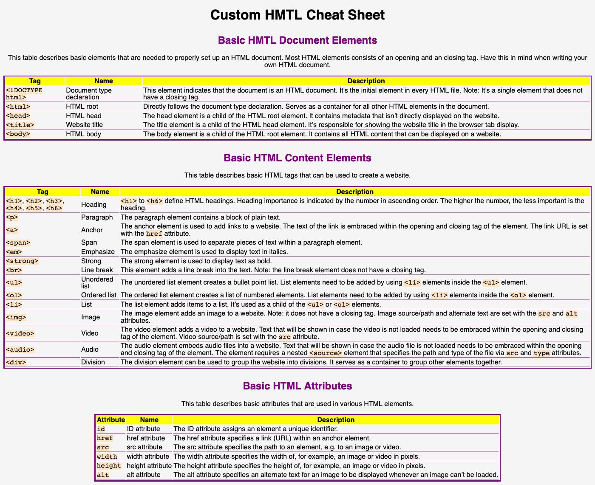

# Build Your Own Cheat Sheet

This is a HTML/CSS CodeCademy project done on my own computer. It's a simple website listing basic HTML elements, including tags and usage details.

## Description
The project's task was to build a custom HTML or CSS documentation ("cheat sheet"). 

Project requirements:
* Use HTML tables to display documentation.
* Utilize a custom color scheme for the website.
* Use custom style to display code (e.g. HTML tags). The style should deploy monospace font and custom background color. 

## Screenshot
This is how the built website looks like:

## Built with

* Visual Studio Code
* HTML
* CSS
* Markdown

## Run
Download the respository and open index.html in a browser. 

